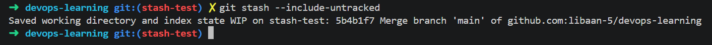

# 03-stash-practice

Goal: Simulate interruptions and context switching.

Steps:

## 1) Create a file.


## 2) Create a new branch and then git stash

- ```git checkout -b stash-test``` creates a new branch and switches to it automatically. 


- The ```--include-untracked``` option includes untracked items when stashing.  



## 3) Check the stashed changes: git stash list

- ```git stash list``` shows all of the stashed changes, with the latest commited change.
- It works on any branch, making it a global command. This allows for safe context switching/interruptions, making it a useful feature. 


## 4) Return and restore: git stash pop

Observed behaviour:
- “Already up to date.”
- Untracked files restored
- Stash entry dropped (```git stash list``` returns nothing)
- Files visible on every branch (because ```git stash pop --include-untracked``` was used)


## Lessons learned:

1) ```git stash``` isn't required if a file doesn't exist across both branches. However it's required if a file is edited (and is different) across multiple branches. 
2) It's fine to ```git stash``` multiple times, that's how the command is designed.
3) **IMPORTANT:** Tracked files that are stashed belong to specific branches. Untracked files that are stashed i.e. via ```git stash pop --include-untracked```will remain in the working directory and will follow you across all branches as you navigate.


## What I would do in the future - Real world stash workflow:

1) I modify tracked files on Branch A (code, configs, docs).

Then, I get interrupted and need to switch to Branch B.
2) Before switching I stage my tracked changes:
```bash
git add .
```

3) Stash the tracked changes (to prepare to switch branches):
```bash 
git stash
```

4) Switch to Branch B:
```bash
git checkout branchB
```

5) Finish the work on Branch B and commit:
```bash
git add .
git commit -m "fix: whatever you needed to do"
```

6) Confirm Branch B is clean
```bash
git status
```

7) Switch back to Branch A:
```bash 
git checkout branchA
```

8) Restore the original work:
```
git stash pop
```

9) Finish the original work that was interrupted and commit:
```bash
git add .
git commit -m "continue work from before interruption"
```