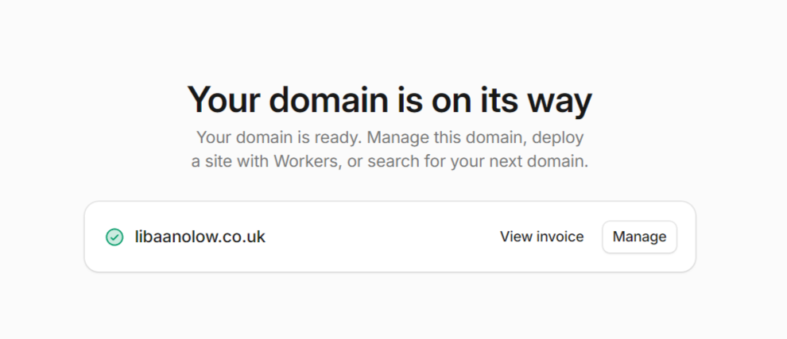

# 01-buy-a-domain

Goal: Purchase a personal domain for hosting.

Steps:

## 1) Choose a domain registrar
- Common examples of domain registrars include Cloudflare, Namecheap and AWS Route53.
- The AWS free plan not allowing me to purchase a domain using the free $100 credits I was given (proof below).


- I found out that Cloudflare is more flexible (as Route53 is more AWS-centric) and it provides clean DNS management, so I opted for Cloudflare as my domain registrar.

## 2) Purchase a domain
- I wanted my domain to be something personal, e.g. my name.
- I searched on Cloudflare for domains which were cheap and looked nice and I came across ```libaanolow.co.uk```. 
- I completed checkout and verified ownership.



Lessons learned:
- I learnt the differences between domain registrars (Cloudflare vs Route53 vs Namecheap).
- I also learnt that AWS credits cannot be used for domain purchases.
- Cloudflare is cheaper than registering a domain from Route 53, and I can still use Route 53 alongside it.